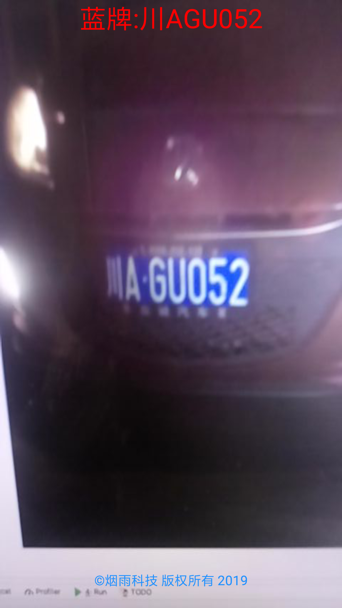

## 基于EasyPR的车牌识别android实现

EasyPR4Android，基于[EasyPR](https://github.com/liuruoze/EasyPR)1.6的android实现, 提供编译好的[mrcar.apk](https://github.com/imistyrain/EasyPR4Android/releases)安装运行demo.

### 效果图

特性：摄像头实时预览

### 编译和运行：

环境: android studio3.5开发实现，ndk版本为R16b，OpenCV版本为3.2，android SDK版本为28，最低要求21。

* 1.下载并配置[android studio 3.5](http://www.android-studio.org/)

* 2.配置NDK16b[ndk r16b](http://blog.csdn.net/shuzfan/article/details/52690554)

* 3.编译并运行，也可以直接下载编译好的[apk](https://github.com/imistyrain/EasyPR4Android/releases)安装使用

本项目定义了三个Activity, 其中

* [PhotoActivity](app/src/main/java/yanyu/com/mrcar/PhotoActivity.java)是从图片和系统相机抓取图片进行识别

* [CVCameraActivity](app/src/main/java/yanyu/com/mrcar/CVCameraActivity.java)是用OpenCV的JavaCameraView实时识别，由于OpenCV实现的限制，其只能用于横屏，虽然也有trick能使其支持竖屏，但会有性能损失，为此产生了第三种

* [CameraActivity](app/src/main/java/yanyu/com/mrcar/CameraActivity.java)原始摄像头实时识别，抓取NV21数据送到jni中，并将其抓换成RGB数据进行处理，其支持竖屏识别。

### 参考：

* 1.[Native方式集成OpenCV](https://github.com/ShawnZhang31/opencv-android-studio)

* 2.[JNI两种注册过程实战](https://blog.csdn.net/xsf50717/article/details/54693802)

* 3.[Android Camera1 教程 · 第二章 · 预览](https://www.jianshu.com/p/705d4792e836)

* 4.[ios 端车牌识别](https://github.com/imistyrain/EasyPR-Swift)